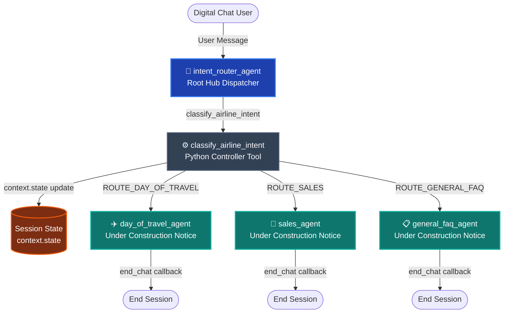

# SkyFlow Airlines — GECX Agent Studio Intent Router Demo

[](cxaslint.yaml)
[](evals/)
[](TDD.md)
[](gecx-config.json)

A production-ready **GECX Agent Studio (CXAS)** reference implementation demonstrating how to build **high-precision, deterministic Intent Routers** in enterprise conversational AI applications.

This reference architecture models a full **Airline Customer Service** ecosystem with a root hub intent router and three specialized spoke sub-agents based on Google Cloud conversational AI best practices.

---

## 🎯 Key Architectural Takeaways for Customers

| Design Pattern | Prompt-Heavy Routers (Anti-Pattern) | Tool-First Intent Router (SkyFlow Best Practice) |
| :--- | :--- | :--- |
| **Routing Logic** | Instructions encode complex branching in prose. | **Deterministic Python Controller** (`classify_airline_intent`). |
| **State & Counters** | Model prompted to count retry attempts (`count = count + 1`). | **Python state machine** reads/writes `context.state` directly. |
| **Catalog Sync** | Manually updating prompt strings across multiple agents. | **Single Source of Truth (`sources/intents.yaml`)** compiled into code. |
| **Silent Handover** | Model speaks before transferring, causing double-talk. | **`agent_action: ""`** enables clean, silent delegation to sub-agents. |
| **Session Control** | Dangling open chat sessions. | **`end_chat` Callback** emits deterministic session completion events. |

---

## 🏗️ Multi-Agent Spoke-Hub Architecture



---

## 📁 Repository Structure

```
├── cxas_app/
│   └── SkyFlowAirlineApp/
│       ├── app.json                          # App descriptor (variables, sequential mode, API profile)
│       ├── agents/
│       │   ├── intent_router_agent/          # Root Hub Agent (dispatcher)
│       │   │   ├── after_model_callbacks/    # end_chat callback
│       │   │   ├── instruction.txt           # Router prompt instructions and few-shots
│       │   │   └── intent_router_agent.json  # Agent configuration descriptor
│       │   ├── day_of_travel_agent/          # Spoke 1: Day of Travel (under construction)
│       │   ├── sales_agent/                  # Spoke 2: Ancillary Sales (under construction)
│       │   └── general_faq_agent/            # Spoke 3: General FAQ (under construction)
│       └── tools/
│           └── classify_airline_intent/      # Router Controller Tool (single source sync)
├── sources/
│   └── intents.yaml                          # Canonical catalog of 3 1:1 sub-agent domain intents
├── scripts/
│   ├── generate_intents.py                   # Single Source compiler (YAML -> Python with --check CI gate)
│   └── drive_session.py                      # Interactive CLI simulator and test driver
├── evals/
│   ├── conftest.py                           # Pytest fixtures and mock platform context
│   ├── tool_tests/                           # 100% unit test coverage for classify_airline_intent
│   ├── callback_tests/                       # end_chat callback lifecycle tests
│   ├── goldens/                              # CX Agent Studio Golden Eval suites
│   └── sims/                                 # Goal-oriented simulation scenarios
├── cxaslint.yaml                             # Zero-warning linter policy
├── gecx-config.json                          # Deployment environment configuration
├── TDD.md                                    # Technical Design Document
└── CUSTOMER_DEMO_GUIDE.md                    # Live customer presentation script & walkthrough
```

---

## 🚀 Quickstart & Verification

### 1. Run Static Linter
Verify that the application complies with all Google Cloud CXAS and CES schema validation rules (guaranteed **0 errors, 0 warnings**):

```bash
uv run cxas lint --app-dir .
```

### 2. Run Comprehensive Unit & Callback Evaluations
Execute the automated tests covering tools, retry counters, state transitions, and chat callbacks:

```bash
PYTHONDONTWRITEBYTECODE=1 uv run pytest evals/ -v
```

### 3. Verify Single Source of Truth Compilation
Ensure `sources/intents.yaml` and `classify_airline_intent` are in sync:

```bash
uv run python scripts/generate_intents.py --check
```

### 4. Run Interactive Terminal Emulator
Test conversational turns and inspect raw tool traces in the shell:

```bash
uv run python scripts/drive_session.py
# Or run a preset scenario:
uv run python scripts/drive_session.py --scenario day_of_travel
```

---

## 👥 Customer Demo Presets

1. **Day of Travel Routing**: *"What gate does flight SK101 leave from and is it delayed?"* -> Router classifies `DAY_OF_TRAVEL`, seamlessly routes to `day_of_travel_agent`, which replies with under-construction notice and ends session.
2. **Ancillary Sales Routing**: *"I would like to add fast track security to my flight"* -> Router classifies `SALES`, seamlessly routes to `sales_agent`, which replies with under-construction notice and ends session.
3. **General FAQ Routing**: *"What are your carry on luggage dimension limits?"* -> Router classifies `GENERAL_FAQ`, seamlessly routes to `general_faq_agent`, which replies with under-construction notice and ends session.
4. **Ambiguity Recovery**: *"I need some help"* -> Asks one clarifying question with domain options, then routes smoothly on turn 2.
5. **Out-of-Scope Protection**: *"Can you order a pizza to terminal 2?"* -> Polite airline scope boundary deflection without hallucination.

For a complete presentation script, see [CUSTOMER_DEMO_GUIDE.md](CUSTOMER_DEMO_GUIDE.md).
